# Learning Platform

**My Learning Platform** is a full-featured web application designed to provide a seamless online learning experience. Users can explore a wide range of courses, view trending courses, and purchase them directly from the platform. The project is built with modern technologies to ensure a smooth, user-friendly experience for both learners and administrators.

## Features

- **Attractive and Responsive Design:** User interface adapts to all devices and screen sizes.
- **Course Catalog:** Display course details, including images, descriptions, and prices.
- **Trending Courses Section:** Highlight the most popular courses based on user activity.
- **Shopping Cart:** Add courses to the cart, modify quantities, and view cart contents.
- **Secure Checkout:** Support for multiple payment methods with secure transactions.
- **User Accounts:** User registration, login, and order history.
- **Admin Dashboard:** Allows administrators to manage the platform:
  - View and manage all orders.
  - Create and manage categories and courses.
  - Add or modify user roles (Student or Admin).
- **And More Ideas**  

## Technologies Used

- **Frontend:** HTML, CSS, JavaScript, Bootstrap
- **Backend:** C#, ASP.NET Core, Entity Framework
- **Database:** SQL Server
- **Version Control:** Git

## Screenshot 
## User Demo:

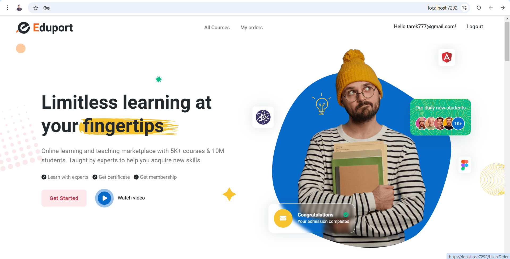

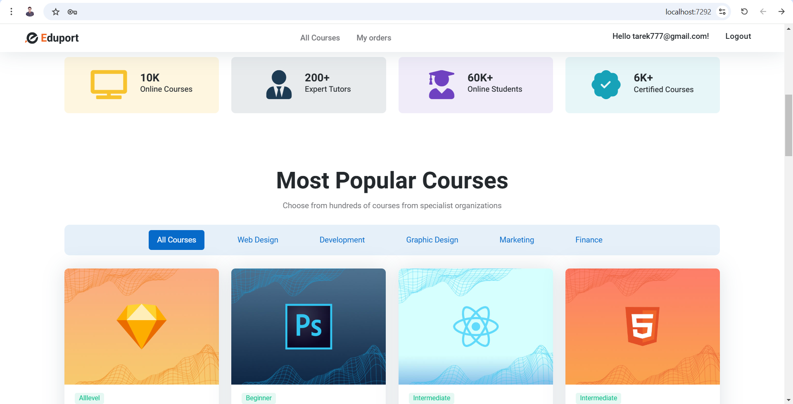

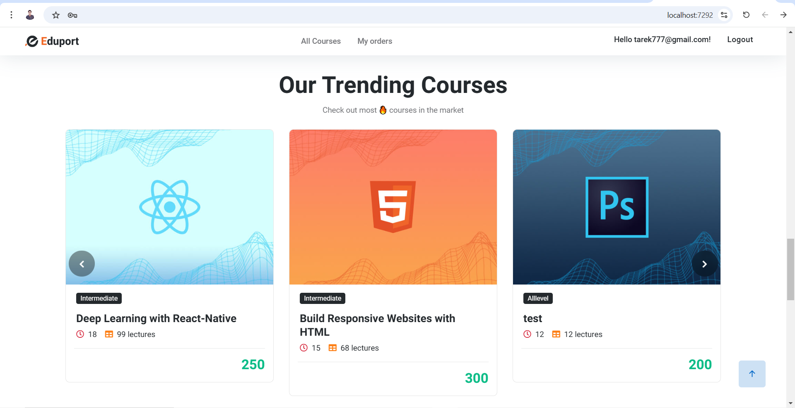

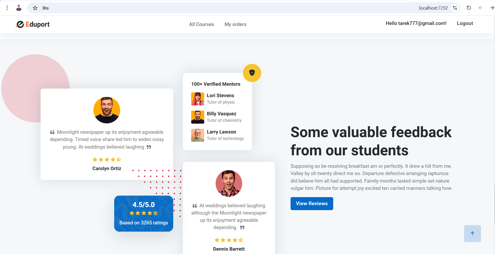

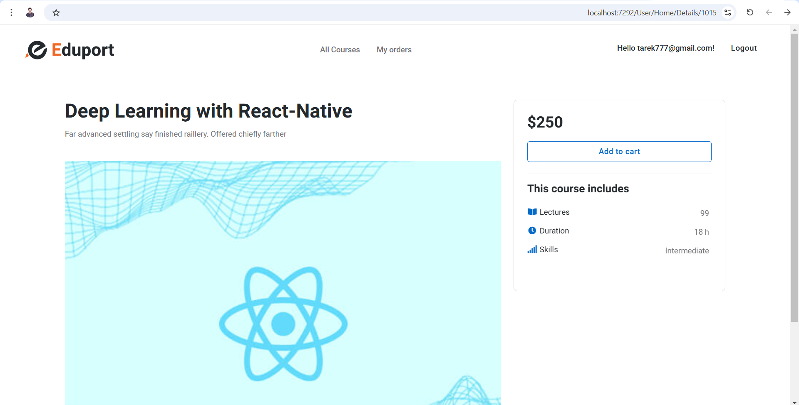

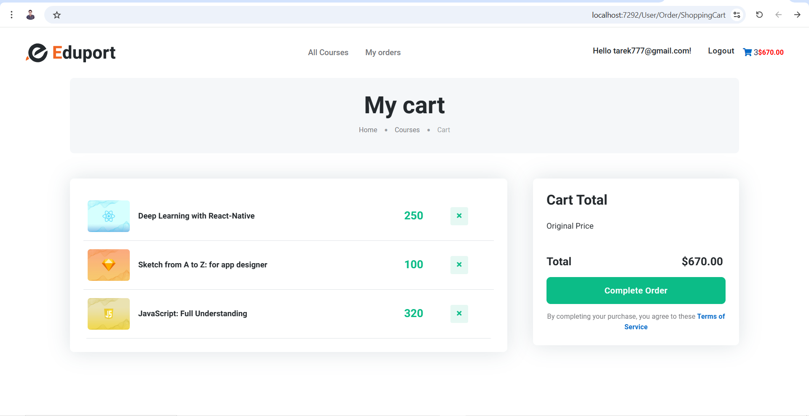

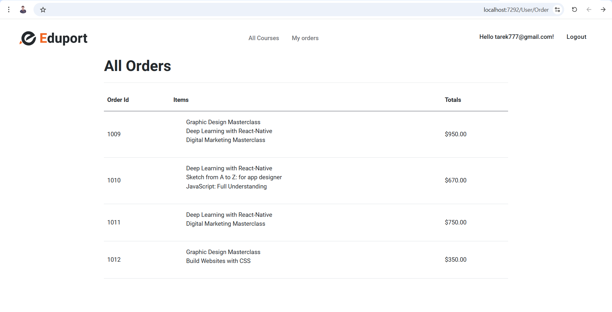

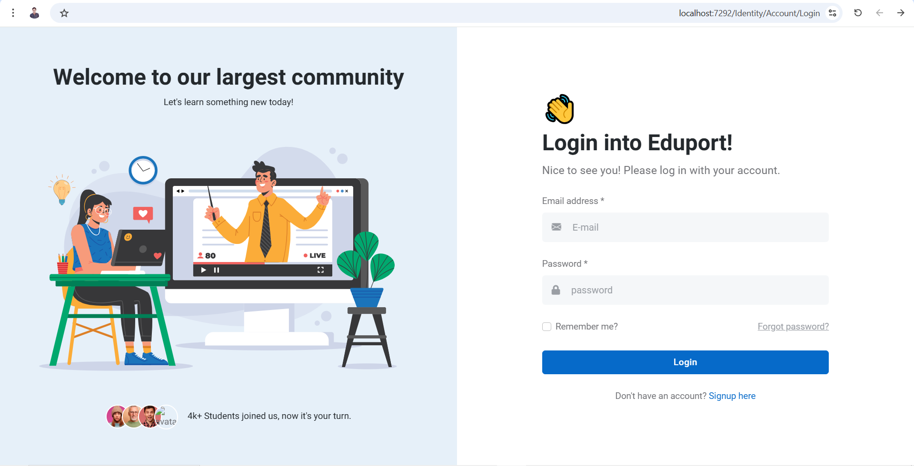

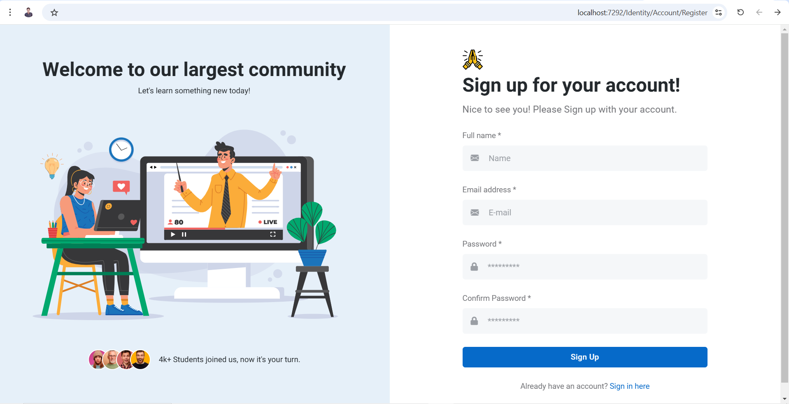

## Admin Demo:

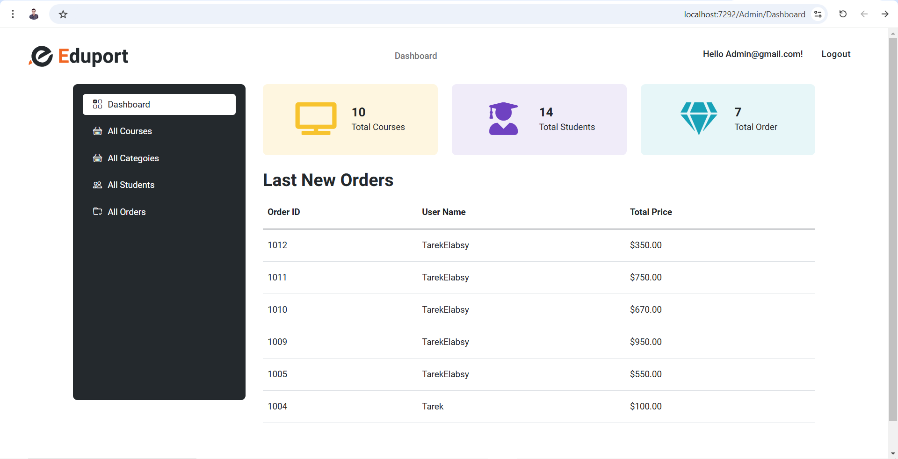

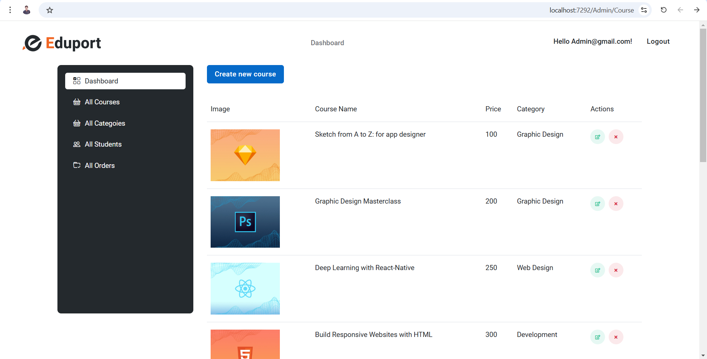

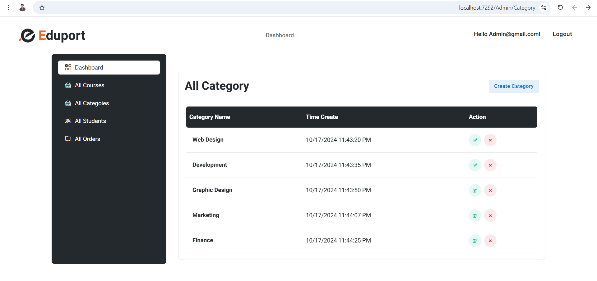

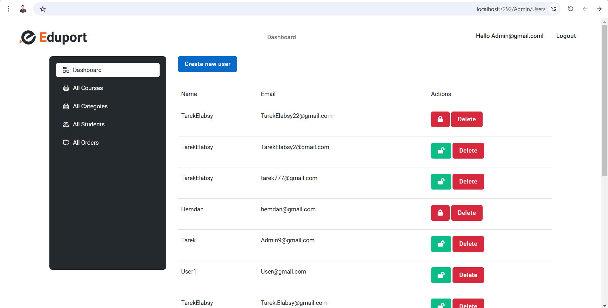

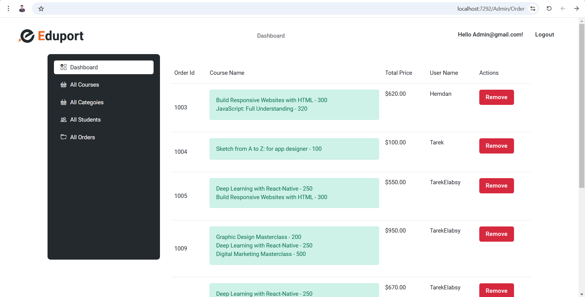

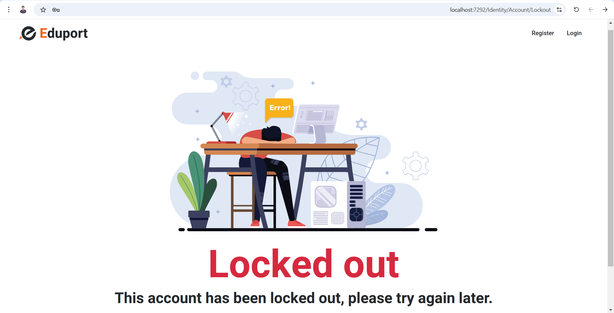

## Contact

For any inquiries or questions, please  connect with me on [LinkedIn](https://www.linkedin.com/in/tarek-elabsy222).

Feel free to adjust the placeholders and details as needed. If there's anything more you'd like to add or modify, let me know!
